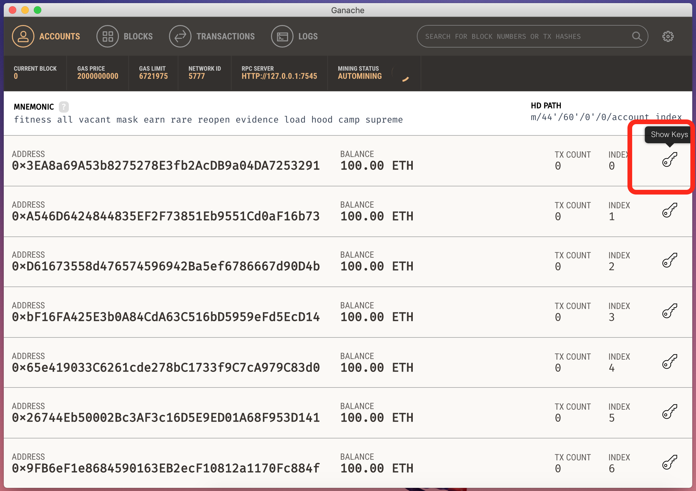

섹션 11 - Create a Smart Contract
====

목차
----

* 준비
* 전체 코드
* Part I - Deploy Contract
* Part II - Interact with Contract
* 디버깅 (실습)


준비
----

### Ganache 설치

아래 홈페이지에서 Ganache를 다운로드받아 설치합니다.
- https://truffleframework.com/ganache
  
### MyEtherWallet 설치

아래 홈페이지에서 MyEtherWallet을 다운로드받아 압축을 풉니다. (버전 v3.11.2.4)
- https://github.com/kvhnuke/etherwallet/releases

etherwallet-v3.11.2.4 디렉토리 아래에 index.html을 실행합니다.

### Remix - Solidity IDE

Remix라는 Solidity용 웹 IDE를 엽니다.
- https://remix.ethereum.org


전체 코드
----

```solidity
// Hadcoins ICO

// Version of compiler
pragma solidity ^0.4.11;

contract hadcoin_ico {

    // Introducing the maximum number of Hadcoins available for sale
    uint public max_hadcoins = 1000000;

    // Introducing the USD to Hadcoins conversion rate
    uint public usd_to_hadcoins = 1000;

    // Introducing the total number of Hadcoins that have been bought by the inventors
    uint public total_hadcoins_bought = 0;

    // Mapping from the investor address to its equity in Hadcoins and USD
    mapping(address => uint) equity_hadcoins;
    mapping(address => uint) equity_usd;

    // Checking if an investor can buy Hadcoins
    modifier can_buy_hadcoins(uint usd_invested) {
        require (usd_invested * usd_to_hadcoins + total_hadcoins_bought <= max_hadcoins);
        _;
    }

    // Getting the equity in Hadcoins of an investor
    function equity_in_hadcoins(address investor) external constant returns (uint) {
        return equity_hadcoins[investor];
    }

    // Getting the equity in USD of an investor
    function equity_in_usd(address investor) external constant returns (uint) {
        return equity_usd[investor];
    }

    // Buying Hadcoins
    function buy_hadcoins(address investor, uint usd_invested) external
    can_buy_hadcoins(usd_invested) {
        uint hadcoins_bought = usd_invested * usd_to_hadcoins;
        equity_hadcoins[investor] += hadcoins_bought;
        equity_usd[investor] = equity_hadcoins[investor] / usd_to_hadcoins;
        total_hadcoins_bought += hadcoins_bought;
    }

    // Selling Hadcoins
    function sell_hadcoins(address investor, uint hadcoins_sold) external {
        equity_hadcoins[investor] -= hadcoins_sold;
        equity_usd[investor] = equity_hadcoins[investor] / usd_to_hadcoins;
        total_hadcoins_bought -= hadcoins_sold;
    }

}
```

[다운로드](hadcoins_ico.sol)


Part I - Deploy Contract
----

1. (MEW) Custom Network를 설정합니다.


2. (Ganache) URL과 포트 번호를 확인합니다.


3. (MEW) 노드명은 알아보기 편하게 적고 URL과 포트 번호를 입력합니다.


4. (MEW) 스마트 콘트랙트를 배포하는 화면으로 이동합니다.


5. (Remix) 코드를 붙여넣고 컴파일한 다음 "Details" 내용을 펼칩니다.


6. (Remix) 바이트 코드를 복사합니다.


7. (MEW) JSON에서 "Object" 키의 값만 남기고 앞/뒤 부분은 제거합니다.


8. (Ganache) 개인키를 확인하기 위해 "Key"를 누릅니다.


9. (Ganache) 개인키 내용을 복사합니다.


10. (MEW) "Private Key"를 선택한 다음 개인키를 붙여넣습니다.


11. (MEW) 서명 후 스마트 콘트랙트를 배포합니다.


12. (Ganache) 배포된 스마트 콘트랙트를 확인하기 위해 "BLOCKS" 메뉴로 이동합니다.


13. (Ganache) 새로 생성된 블록을 열고,


14. (Ganache) 배포된 트랜잭션을 확인합니다.


Part II - Interact with Contract
----

1. (Ganache) 생성된 스마트 컨트랙트의 주소를 복사합니다.


2. (MEW) 스마트 콘트랙트와 Interact하는 화면으로 이동하여 주소를 붙여넣습니다.


3. (Remix) "Details" 내용에서 ABI를 복사합니다.


4. (MEW) ABI를 붙여넣고 "Access" 버튼을 누릅니다.


5. (MEW) 아래에 "Read/Write Contract" 화면이 나타나고, 작성했던 함수들이 메뉴로 펼쳐집니다.


6. (Ganache) Interact할 월렛의 주소를 복사합니다.


7. (MEW) "buy_hadcoins" 함수를 선택하고 "investor"에 복사한 월렛 주소를 넣고, "usd_invested"에 금액을 넣습니다.


8. (MEW) Write의 경우 트랜잭션을 블럭에 저장합니다.


9. (Ganache) 새로 생성된 블록을 확인합니다.


10. (Ganache) "TRANSACTIONS" 메뉴로 이동하여 새로 생성된 트랜잭션을 확인합니다.


11. (MEW) "equity_in_hadcoins" 함수로 구매한 코인의 갯수를 확인합니다.


다른 다양한 함수들을 실행해 봅니다.


디버깅 (실습)
----

Hadcoin의 총 발행량은 1백만개로 제한되어 있습니다. "buy_hadcoins" 함수를 열고 1백만개가 넘도록 구매해 보면 제약 조건에 의해 구매가 실패하는 것을 확인할 수 있습니다.

그러나 "sell_hadcoins" 함수에서는 investor(월렛)가 가진 코인의 갯수보다 많이 판매하는 트랜잭션을 블록에 쓸 수 있습니다. 이렇게 되면 소위 underflow가 발생하여 investor가 보유한 코인의 갯수가 이상한 값을 가지게 됩니다.

이를 해결하기 위해 modifier를 추가로 구현하고, "sell_hadcoins" 함수에 이 modifier를 적용하여 해당 버그를 수정해 봅시다.

[모범 답안](hadcoins_ico_debug.sol)
